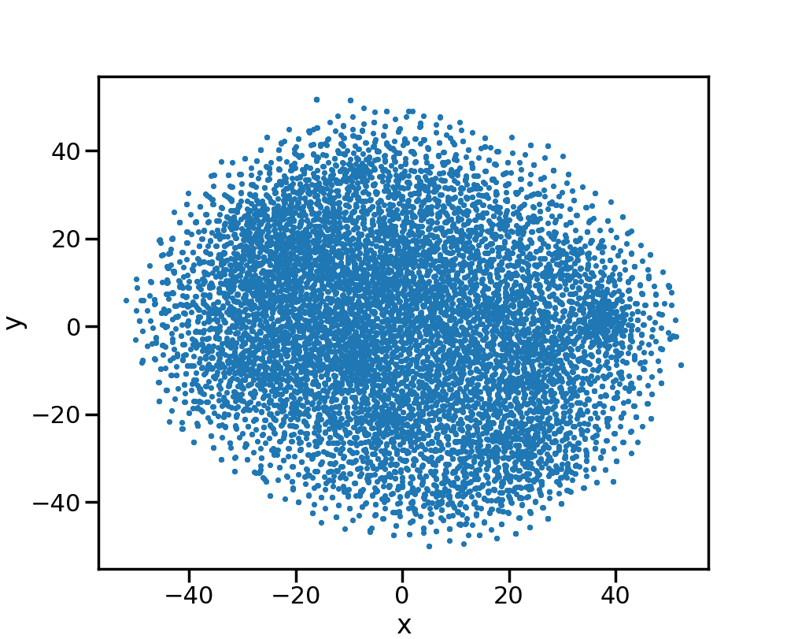
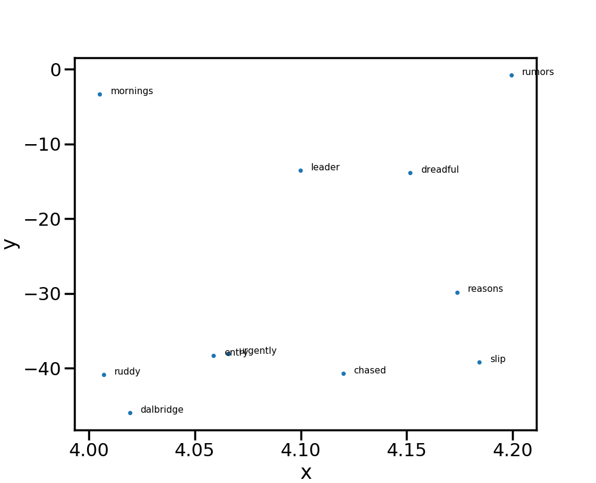
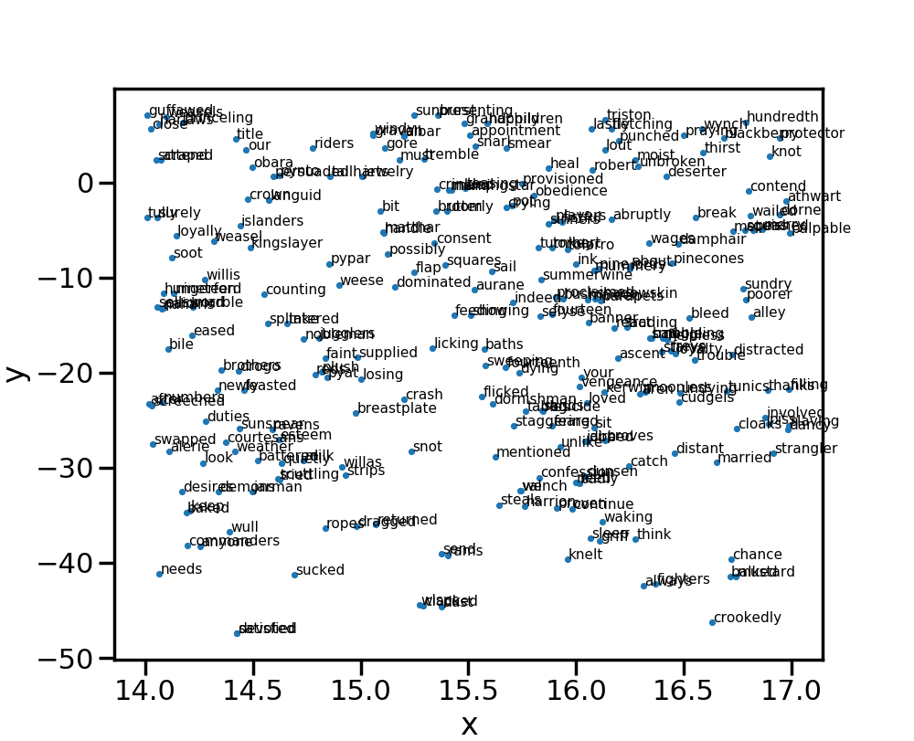

# Word2Vec
NLP requires dealing with words from our vocabulory. 
But our computers are (unfortunately) bad with things other than numbers. 
Word2Vec is an approach to convert words from our raw corpus to vectors in such a manner that each element of vector represents a relationship between the words. 
This means using these vectors in place of words will give our model better understanding of the input text and it can work on it fundamentally well.

## Model

||
|:--------------------:|
|Noise classifier|

## Results

||
|:--------------------:|
|All 10,000 vocabulary words using TSNE|

## Bounding Results

||
|:--------------------:|
|Region bounded - x (4 to 4.2) y (-0.5, -0.1)|

  

||
|:--------------------:|
|Region bounded - x (14 to 17) y (4, 7.5)|
